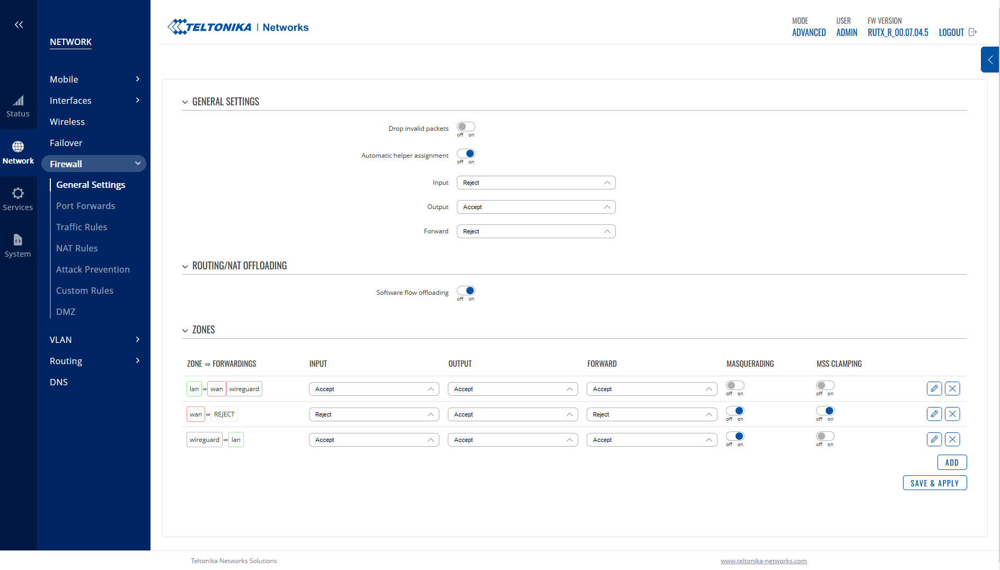

# Teltonika-Notes

## General Notes
(in this author's view) Teltonika routers represent a great mix of features/value/ease-of-use and availability. Many models can be had from Mouser and Digi Key, while having very reasonable price points.  
Unlike many other embedded routers, they feature to ability to be Wireguard VPN peers. They can also do this without any command-line hacking (looking at you Ubiquiti).  

## How to set up Teltonika RUTX (and others) as Wireguard Peer
This guide applies to RUTX hardware but could also apply to RUT hardware or other Teltonika OpenWRT routers.  

This guide applies to Firmware RUTOS 00.07.04.5 and its tested on the later 00.07.06.3

Please make sure you have the latest firmware installed on your device. If your menus are in the older style and do not look like the screencaps below, **definitely update your firmware**. 

Before starting this guide, have a private key, public key and server set up. In this case, I am using a server it set up in AWS.

**I want to be able to route to VPN addresses, but also pass all traffic through the VPN**.  

### Set up WG
- Set the GUI to `Advanced` from the **top right**
- Navigate to `Services > VPN > Wireguard` 

- Create a new configuration and give it a name. Press `Apply`.

### Set up Keys and Ports
- In `General Settings` fill out the following
- Set your `Private Key` to your credential's private key
- Set your `Public Key` to your credential's public key (this is optional, but it does make tracking your configs somewhat easier)
- Set your `Listen Port` to that of your designated server
- Set `IP Addresses` **to your peer's address with a /24 CIDR block suffix**

### Configure Metrics and DNS
- navigate to `Advanced Settings`
- Set `Metric` to `10`
- Set `MTU` to `1000` (this could likely be higher, and you may have luck setting it higher)
- Set `DNS Server` to your **server WG VPN address**, if you set global DNS servers this will not work

- Create and name a new peer and press `Add`

### Peer General Setup
- In `Public Key` add your **server's public key**
- In `Allowed IPs` set:
  - `127.0.0.0/24`
  - `0.0.0.0/24` **NOTE: this is not `/0` as you might expect**  
- In `Description` name your peer
- Set `Route Allowed IPs` to **ON**

### Peer Advanced Setup
- Set `Preshared key` to none
- Set `Endpoint host` to your server's public IP
- Set `Endpoint port` to your servers incoming WG port
- Set `Persist keep alive` to 25
- Set `Routing table` to none

- Press `Save and Apply`
- Press `Save and Apply` to the whole setup

### Firewall Settings
- Now navigate to `Network > Firewall > General Settings`
- Your zones should change to read
- 
| Zone = Forwardings  | Input  | Output | Forward | Masquerading | MSS Clamping |
|---------------------|--------|--------|---------|--------------|--------------|
| lan = wan wireguard | Accept | Accept | Accept  | off          | off          |
| wan = REJECT        | Reject | Accept | Reject  | on           | on           |
| wireguard = lan     | Accept | Accept | Accept  | on           | off          |

- Press `Save and Apply`

### Enable WG Tunnel
- Navigate back to `Services > VPN > Wireguard` and enable your tunnel

- If you have configured everything correctly your public IP should now be that of your VPN server
- If you have **not** configured this correctly you will likely have DNS but no internet connectivity
- If security is important to you, double check your DNS leakdown

### Test WAN IP
- Nagivate to `System > Maintenance > CLI` and login
  - The login is always `root`
  - The password is the admin password for the webgui, set at initial setup
- Run `curl ifconfig.co` and it should return your public IP address
  
## Advanced WG Command Line
- Navigate to `System > CLI`
- Login 
  - **username is always `root`**
  - Password is your normal webGUI password
  - (Author's note) I don't know how this behaves with multiple user accounts on the router
    
### Check Status of the WG Service
- Type `wg` and press `enter`

### Check WAN IP Address
- run `curl ifoncif.io` and it should return your public IP.

### Troubleshooting and Errata
- If you add or delete a WG connection, I've had to reboot the entire router between deletion and creating a new connection. The connection would create correctly, but would not route any traffic through the tunnel 
- Anecdotally I've seen WG add ~20ms of ping time to a WAN connection, your hardware may vary. 
- You can mess with your MTU size if you are experiencing poor throughput

