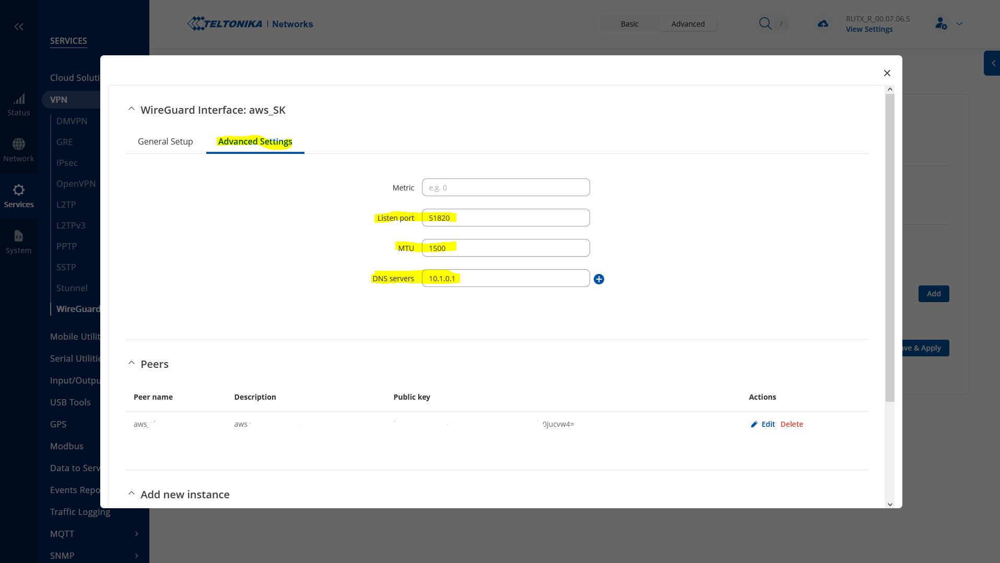

# Notes on Hub and Spoke Wireguard with VLANS on Teltonika Modems

## Background
As a novice to Wireguard, but not to networking, I had some growing pains moving from OpenVPN to WG and figuring out which topologies worked well for my purposes. I've written the following to help future internet travellers with questions. 

I'm a huge fan of Teltonika routers. I found their forum to be a bit sparse for this specific issue, so I wrote it up.  

## Hardware
- This guide is written using a Teltonika RUTX-R1 and a RUT-X09
  - **NOTE** When purchasing these, check for the region locking of the radios.
- The AWS portion of this is using a `T3.micro` running Ubuntu 22.04

## Architecture


This architecture can support `n` computers behind `n` Spoke router(s). And could support multiple VLANs behind spokes, if desired.   
It can also support `n` computers in the AWS VPC subnet, to allow any computer on each spoke talk to any computer behind the AWS WG Hub.

### Advantage of this Architecture:
- Outgoing connections from each spoke. This avoids things like CG-NAT and shifting WAN connections
- Support for Teltonika's WAN load balancer
- Ability to send all traffic through Hub's internet egress, if desired
- Segmentation of logical LANs on spokes (usual reasons for using a VLAN)
- Bi-directional communications 
- Individual clients do not need their own VPN credentials, or need to know anything about the VPN

### Disadvantage of this Architecture:
- Requirement for a Hub machine to be on all the time (best if this is in some sort of cloud hosting, but not strictly required)
- Not a particularity portable setup to bring all elements off public internet

### References
To generate keys and a few other useful items, I've been using the excellent https://www.wireguardconfig.com/  

## Setup

## Setting Up The Hub Server

### Install WG
- Instructions are largely lifted from https://dev.to/gabrieltetzner/setting-up-a-vpn-with-wireguard-server-on-aws-ec2-4a49 with light edits
- Spin an Ubuntu machine of your choice in EC2 and open the Security Group to at least Port 22 and 18520
- `sudo apt-get update`
- `sudo apt-get install wireguard`
- `sudo mkdir /etc/wireguard/`
- Generate keys as you wish. I found it was easier to use Teltonika's key generation tools

### Configure the WG Server Configuration
- `sudo nano /etc/wireguard/wg0.conf`
- Edit the file to look like this:
  - ```
	[Interface]
	Address = 10.1.0.1/24
	PreUp = sysctl -w net.ipv4.conf.all.forwarding=1
	PostUp = iptables -A FORWARD -i %i -j ACCEPT; iptables -t nat -A POSTROUTING -o ens5 -j MASQUERADE
	PostDown = iptables -D FORWARD -i %i -j ACCEPT; iptables -t nat -D POSTROUTING -o ens5 -j MASQUERADE
	ListenPort = 51820
	PrivateKey = [private key]

	[Peer]
	#Spoke 2 Router
	PublicKey = [public key]
	AllowedIPs = 10.1.0.3/32

	[Peer]
	#Spoke 1 Router
	PublicKey = [public key]
	AllowedIPs = 10.1.0.5/32
	```
  - **NOTE** Your EC2 machine ethernet interface is likely NOT named `eth0`, make sure to replace it with the correct interface
  - **NOTE** the `SaveConfig = True` flag causes notes to be overwritten and this is deeply annoying, I don't reccomend you use it
- You could add other peers of course
- Breaking this down further we get
  - ```
  	[Interface]
	Address = 10.1.0.1/24
	```
	- This assigns the Hub WG interface to 10.1.0.1 and defines the CIDR block that our WG peers operate in
  - The `PostUp` and `PostDown` commands enable traffic masquerading, which is key for both inter-spoke communications as well as egressing from the Hub appearing to have the EC2 public WAN address
  - ```
  	[Peer]
	PublicKey = [public key]
	AllowedIPs = 10.1.0.5/32, 192.168.20.0/24, 192.168.100.0/24
	```
	- `AllowedIPs` has both VLAN segments listed. **If both are not present, you will not be able to reach the non-listed VLANS**
	- **NOTE** Inter-VLAN traffic must be allowed by the firewall in the Teltonika for this work correctly. The example below illustrates it set that way. 

### A Note on AllowedIPs
- The `AllowedIPs` field determines how the routes are formed, from the spoke side. 
- Previously, I had put `AllowedIP` values into the hub configuration. This seems to no longer be required. 
- **In Short**
  - Put the ranges you want to reach in the client `AllowedIP` field. Remember to include the WG hub range, if you desire to reach that for config purposes. 

### Enable IP Forwarding
  - `echo "net.ipv4.ip_forward = 1" | sudo tee -a /etc/sysctl.conf`
    - This also gets done by the `PreUp` script above. This is probably a belt and suspenders.
  - `sudo sysctl -p`
- Then up the wg interface with
  - `sudo wg-quick up wg0`
  
### Start the WG Service
- `sudo systemctl enable wg-quick@wg0` to enable the service start on boot
- `sudo systemctl start wg-quick@wg0` to start the service (simply enabling it will have it wait for a reboot before starting)
- Run `sudo systemctl restart wg-quick@wg0.service` after each change to the `wg0.conf` file to allow the changes to take
- **NOTE** By default; the EC2 Ubuntu machines do **not** have `UFW` enabled. There is no need to enable it if your SGs are set up correctly. 
- **NOTE** when doing almost anything in the `/etc/wireguard` folder you must invoke root

## Setting Up Each Spoke

### Setup the Basic LAN and WAN settings
(These instructions assume RUT OS 00.07.06.3 or later)
- Update your Teltonika to latest firmware and modem firmware (if applicable)
- You can use wired or wireless or mobile WAN
- Setup using the Wizard to establish LAN addresses and a DHCP server. Assign DNS to your choice of DNS (it will not be used by clients going through the WG tunnel)

- **Set the GUI to `Advanced` Mode before proceeding**

### Establish VLANs (if desired)
- 
  - Add a VLAN by pressing `Add` and filling in the details
  - This screen also allows you to set tagged or untagged settings for the switch ports (1-4) allowing you to native or trunk the VLAN data. 

- Navigate to `Network > LAN > Add` and fill out the following dialogue
  - 
  - Define your desired DCHP scope and CIDR block. Do not have it overlap with other LAN areas
  - Move to the `Physical Settings` tab and set the interface to `eth0.[x]` where `[x]` is the VLAN number you defined in the previous step
  - Move to the `Firewall Settings` tab and make sure your VLAN is grouped in the LAN group in the firewall as below:
  - 
- Switch the interface on and press `Save and Apply`
  
### A Note on DHCP Reservations on VLANs
- New DHCP clients appear in the `Status > Network > LAN` page as below
  - 
- Click `Create Static` (which is, of course, a reservation not a static)
- Then follow the hyperlink flyout to `Network > DHCP > Static Leases`
- Edit the desired IP address and the error below will appear
  - 
- Press `Save and Apply` the dialogue will show errors for the VLAN DHCP ranges, but will accept the inputs you give it and apply them. You __may__ need to release and renew the client IP for the settings to take effect
 
### Set Up WG Peer on Each Spoke
- Navigate to `Service > VPN > Wireguard` and name your interface and press `Add`
- `General Settings` should match the public and private keys that you established on in `wg0.conf` 
- Set you IP to the IP you allocated in `wg0.conf`
  - 
  
- Move to the `Advanced` tab and set
  - `MTU` to 1500
  - `DNS Server` to the WG IP of the Hub machine
  - 
  - **Press `Save and Apply`**

- Add a peer (the Hub Public key)
- Name your peer and press `Add`
- Then in `General Setup` in __Spoke 1 Router__
  - 
  - `Public Key` is the Public Key of the Hub WG interface
  - `Endpoint Host` is the AWS public IP of the Hub machine. This will also accept DNS entries
  - `Allowed IPs`
    - 192.168.10.0/24 - this is the IP range of the other spoke network
	- 10.1.0.0/24 - this is the IP range of the WG interface itself and allows pinging and direct access to the routers themselves (rather than just the clients __behind__ them)
	- If you'd like all traffic to egress via the Hub interface, (i.e. you want a tradition VPN setup to mask internet activity) you should add `0.0.0.0/0` while technically redundant to the above, it will make toggling this feature a good bit easier. Overall, WAN access will be slower if it's routed through the VPN hub
	- **NOTE** On the other Spoke router configure `Allowed IPs` **to add each of the desired subnets on the other spokes** in this case, __Spoke B Router__ looks like this:
	- 
	- `Route Allowed IPs` to ON
- Move to `Advanced Setting` Tab
  - Set your `Endpoint Port` to the port on your Hub machine (make sure the SG has this port open too)
  - `Persistent Keepalive` set to 25. This works well
  -

- Turn the tunnel on and press `Save and Apply`
  - 


## Firewall settings on Spokes

### Firewall Settings
- Now navigate to `Network > Firewall > General Settings`
- Your zones should change to read

| Zone = Forwardings  | Input  | Output | Forward | Masquerading | MSS Clamping |
|---------------------|--------|--------|---------|--------------|--------------|
| lan = wan wireguard | Accept | Accept | Accept  | off          | off          |
| wan = REJECT        | Reject | Accept | Reject  | on           | on           |
| wireguard = lan     | Accept | Accept | Accept  | on           | off          |

### Verify Wireguard Connectivity on Spokes
- Login to the CLI by navigating to `System > Maintenance > CLI`
  - The login username is **always** `root`
  - The login password is your admin password
- Type `wg` and look for data the data counters to be rising on each poll
- If no bytes are moving, likely something isn't right

## General Notes
- When making changes to the WG tunnel, it is best to cycle the service `off` and `on` to make sure the settings reconnect. 
- To route all traffic through the egress of the AWS public IP
  - In each Spoke Router add `0.0.0.0/0` to the `Allowed IPs` settings and save.
  
